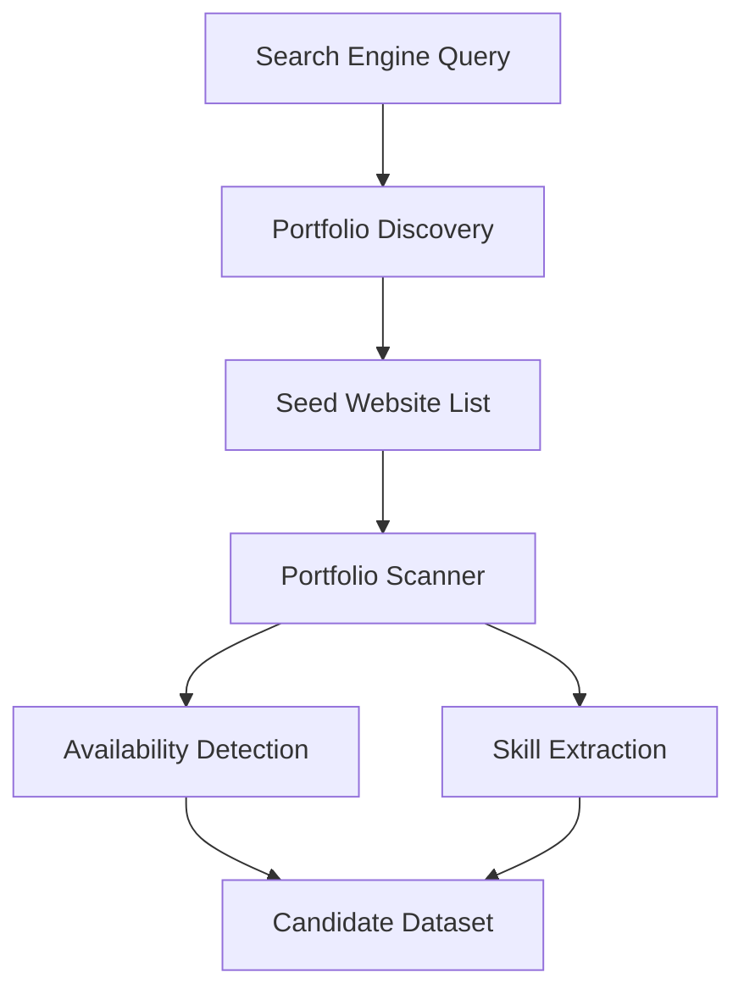

# Developer Portfolio Scanner

A Python project that discovers developer portfolio websites and extracts useful signals such as skills and availability for work.

This project explores how publicly available developer websites can be analyzed to build a simple talent discovery dataset.

---

## Project Motivation

Many developers host personal portfolios that describe:

* their technical skills
* projects they built
* whether they are open to work

Recruiters often manually browse these sites.

This project demonstrates how basic web scraping techniques can automate that discovery process.

---

## System Architecture



---

## Example Dataset

Example output produced by the scanner:

| Website          | Availability | Skills         |
| ---------------- | ------------ | -------------- |
| janedoe.dev      | open to work | python, django |
| alexfrontend.dev | freelance    | react, nextjs  |

---

## Project Structure

```
developer-portfolio-scanner
│
├── data
│   └── websites.txt
│
├── src
│   └── scanner.py
│
├── output
│
├── README.md
└── requirements.txt
```

---

## How It Works

1. Discover developer portfolio sites.
2. Collect a list of website URLs.
3. Scrape portfolio pages.
4. Detect availability signals.
5. Extract technical skills.
6. Export results into a dataset.

---

## Technologies Used

* Python
* Requests
* BeautifulSoup
* Pandas

---

## Future Improvements

* Automated portfolio discovery using search engine scraping
* NLP-based skill extraction
* Portfolio ranking system
* Visualization dashboard

---

## Ethical Considerations

This project only analyzes information that developers publicly publish on their websites.

No personal contact information is collected.

---
