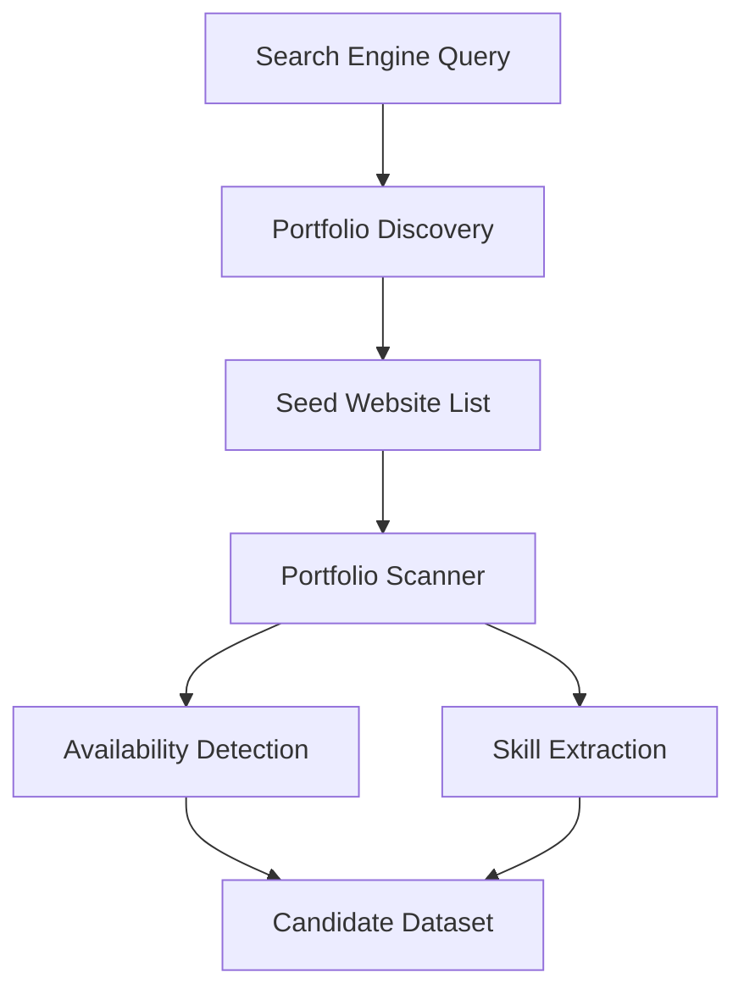

# Developer Portfolio Scanner


A Python project that discovers developer portfolio websites and extracts useful signals such as skills and availability for work.

This project explores how publicly available developer websites can be analyzed to build a simple talent discovery dataset.

---

## Changelog

### v2.0.0 — April 2026
- Replaced CSV logic with a Pandas DataFrame pipeline
- Added `cleaner.py` module for automated data cleaning and score normalisation
- Added `visualiser.py` module generating PNG charts from results
- Added top skills bar chart and availability pie chart to output folder

### v1.0.0 — March 2026
- Initial release
- Multi-path scraper with availability detection and skill extraction
- Regex-based skill detection across 25 technology categories
- CSV output with scoring system
- Modular architecture: `fetcher`, `parser`, `extractor`, `main`

---

## Project Motivation

Many developers host personal portfolios that describe:

* their technical skills
* projects they built
* whether they are open to work

Recruiters often manually browse these sites.

This project demonstrates how basic web scraping techniques can automate that discovery process.

---

## The Problem It Solves

A recruiter or talent scout looking for developers who are open to work has 
two options: post a job and wait, or go looking. If they go looking, that 
means manually visiting portfolio sites one by one — checking for availability 
signals, trying to infer skills from project descriptions, copy-pasting into 
a spreadsheet.

It's slow, inconsistent, and entirely dependent on whoever has time to do it 
that day.

This tool automates that process. Give it a list of URLs and it returns a 
clean, scored dataset of developer availability and skills — in seconds instead 
of hours.

---

## System Architecture



---

## Example Dataset

Example output produced by the scanner:

| Website          | Availability | Skills         |
| ---------------- | ------------ | -------------- |
| janedoe.dev      | open to work | python, django |
| alexfrontend.dev | freelance    | react, nextjs  |

---

## Project Structure

```
developer-portfolio-scanner
│
├── data
│   └── websites.txt
│
├── src
│   └── __init__.py
│   └── main.py
│   └── extractor.py
│   └── fetcher.py
│   └── parser.py
│   └── cleaner.py
│   └── visualiser.py
│
├── output
│   └── .gitkeep
│   └── results.csv
│   └── skills_chart.png
│   └── availability_chart.png
│
├── .gitignore
├── LICENSE
├── README.md
└── requirements.txt
```

---

## How It Works

1. Discover developer portfolio sites.
2. Collect a list of website URLs.
3. Scrape portfolio pages across multiple paths.
4. Detect availability signals.
5. Extract technical skills.
6. Clean and normalise results via Pandas.
7. Export results into a dataset.
8. Generate visualisation charts to the output folder.

---

## Technologies Used

* Python
* Requests
* BeautifulSoup
* Pandas
* Matplotlib

---

## Future Improvements

* Automated portfolio discovery using search engine scraping
* NLP-based skill extraction
* Selenium/Playwright integration for JavaScript-rendered sites
* Portfolio ranking system

---

## Ethical Considerations

This project only analyzes information that developers publicly publish on their websites.

No personal contact information is collected.

---
